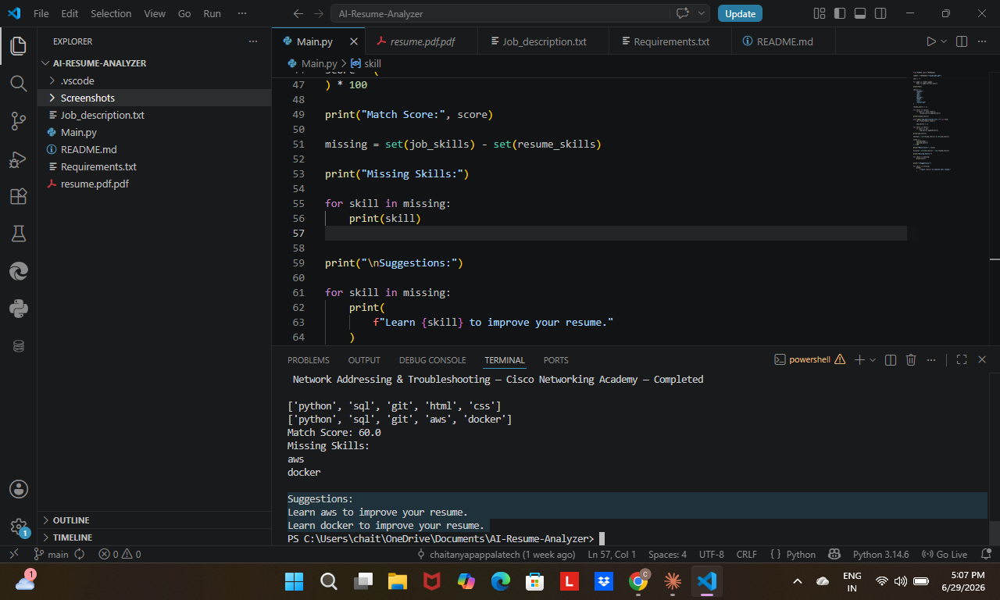

<h1 align="center">🤖 AI Resume Analyzer</h1>

<p align="center">
  An intelligent Python tool that reads your resume, compares it with a job description,<br/>
  calculates a <b>match score</b>, identifies <b>missing skills</b>, and gives <b>personalized recommendations</b>.
</p>

<p align="center">
  
  
  
  
</p>

---

## 📚 Table of Contents

- [What This Project Does](#-what-this-project-does)
- [Live Output Example](#-live-output-example)
- [Features](#-features)
- [Technology Stack](#-technology-stack)
- [Project Structure](#-project-structure)
- [Installation](#-installation)
- [How to Run](#-how-to-run)
- [How It Works](#-how-it-works)
- [Screenshots](#-screenshots)
- [Sample Record](#-sample-record)
- [Learning Outcomes](#-learning-outcomes)
- [Future Improvements](#-future-improvements)
- [Resume Description](#-resume-description)
- [Author](#-author)

---

## 🎯 What This Project Does

> Upload a resume → Get instant skill gap analysis and career recommendations.

| Step | What Happens |
|------|-------------|
| 📄 Step 1 | User provides a resume (PDF) |
| 🔍 Step 2 | System extracts all text from the resume |
| 🧠 Step 3 | AI identifies skills from the resume |
| 📋 Step 4 | Compares skills against a job description |
| 📊 Step 5 | Calculates a Match Score (%) |
| ❌ Step 6 | Identifies Missing Skills |
| 💡 Step 7 | Generates Personalized Recommendations |

---

## 💻 Live Output Example

```
========== AI Resume Analyzer ==========

Resume Skills:
  ✔ Python
  ✔ SQL
  ✔ Git
  ✔ HTML
  ✔ CSS

Job Skills Required:
  ✔ Python
  ✔ SQL
  ✔ Git
  ✔ AWS
  ✔ Docker

----------------------------------------
  Match Score     :  60%
  Matched Skills  :  Python, SQL, Git
  Missing Skills  :  AWS, Docker
----------------------------------------

Recommendations:
  → Learn AWS to improve your resume.
  → Learn Docker to improve your resume.

=========================================
```

---

## ✨ Features

- ✅ PDF Resume Reading & Text Extraction
- ✅ Automatic Skill Identification from Resume
- ✅ Job Description Parsing
- ✅ Match Score Calculation (%)
- ✅ Missing Skill Detection
- ✅ Personalized Learning Recommendations
- ✅ Clean Professional Console Output

---

## 🛠️ Technology Stack

| Technology | Purpose |
|---|---|
| Python 3.x | Core programming language |
| PyPDF2 | Extract text from PDF resumes |
| NLTK | Natural Language Processing |
| VS Code | Code editor |
| Git & GitHub | Version control |

---

## 📂 Project Structure

```
AI-Resume-Analyzer/
│
├── Screenshots/
│   ├── Resume_Skills.png
│   ├── Job_Skills___Match_Score.png
│   ├── Missing_Skills.png
│   └── Suggestions.png
│
├── Main.py                  # Core application logic
├── resume.pdf.pdf           # Sample resume (PDF format)
├── Job_description.txt      # Target job description
├── Requirements.txt         # Python dependencies
└── README.md                # Project documentation
```

---

## ⚙️ Installation

**1. Clone the repository:**
```bash
git clone https://github.com/chaitanyapappalatech/AI-Resume-Analyzer.git
cd AI-Resume-Analyzer
```

**2. Install required libraries:**
```bash
pip install PyPDF2 nltk
```

Or use the requirements file:
```bash
pip install -r Requirements.txt
```

**3. Add your files:**
- Place your resume as `resume.pdf` in the project folder
- Add your target job description in `Job_description.txt`

---

## ▶️ How to Run

```bash
python Main.py
```

---

## 🧠 How It Works

### Step 1 — Extract Resume Text
```python
from PyPDF2 import PdfReader

reader = PdfReader("resume.pdf")
text = ""
for page in reader.pages:
    text += page.extract_text()
```

### Step 2 — Define Skills Library
```python
skills = ["python", "sql", "git", "aws", "docker", "html", "css", "javascript"]
```

### Step 3 — Extract Skills from Resume
```python
resume_skills = [skill for skill in skills if skill in text.lower()]
# Output: ['python', 'sql', 'git', 'html', 'css']
```

### Step 4 — Extract Skills from Job Description
```python
with open("Job_description.txt", "r") as file:
    jd = file.read().lower()

job_skills = [skill for skill in skills if skill in jd]
# Output: ['python', 'sql', 'git', 'aws', 'docker']
```

### Step 5 — Calculate Match Score
```python
matched = set(resume_skills) & set(job_skills)
score = (len(matched) / len(job_skills)) * 100
# Output: Match Score: 60.0
```

### Step 6 — Find Missing Skills & Recommend
```python
missing = set(job_skills) - set(resume_skills)
for skill in missing:
    print(f"Learn {skill} to improve your resume.")
# Output: Learn aws | Learn docker
```

---

## 📸 Screenshots

### 📄 Step 1 — Resume Skills Extracted
> The system reads the PDF resume and identifies skills: `python`, `sql`, `git`, `html`, `css`


---

### 📊 Step 2 — Job Skills & Match Score
> Job description parsed. Skills matched. **Match Score: 60.0**
> Resume Skills: `['python', 'sql', 'git', 'html', 'css']`
> Job Skills: `['python', 'sql', 'git', 'aws', 'docker']`


---

### ❌ Step 3 — Missing Skills Detected
> System identifies skills present in the job description but missing from the resume: **aws**, **docker**


---

### 💡 Step 4 — Suggestions Generated
> Personalized recommendations printed:
> `Learn aws to improve your resume.`
> `Learn docker to improve your resume.`



---

## 🧪 Sample Record

| Field | Value |
|---|---|
| Resume Skills | python, sql, git, html, css |
| Job Skills | python, sql, git, aws, docker |
| Matched Skills | python, sql, git |
| Missing Skills | aws, docker |
| Match Score | 60% |

---

## 🎓 Learning Outcomes

- ✅ Reading and extracting text from PDF files using PyPDF2
- ✅ Natural Language Processing basics with NLTK
- ✅ Set operations in Python (intersection, difference)
- ✅ File handling — reading job descriptions from `.txt`
- ✅ Building a complete end-to-end Python data pipeline
- ✅ Generating actionable output from data analysis
- ✅ Modular and clean Python code structure
- ✅ Version control with Git & GitHub

---

## 🚀 Future Improvements

- [ ] Support DOCX resume format
- [ ] Web interface using Flask or Streamlit
- [ ] AI-powered skill extraction using spaCy or OpenAI API
- [ ] Multiple job description comparison
- [ ] Export analysis report as PDF
- [ ] ATS (Applicant Tracking System) score simulation
- [ ] Resume rewrite suggestions using LLMs

---

## 📄 Resume Description

```
AI Resume Analyzer | Python | PyPDF2 | NLTK

• Developed an AI-powered Resume Analyzer using Python that extracts skills from
  PDF resumes, analyzes them against job descriptions, and generates a match score
  with personalized improvement recommendations.

• Implemented resume-to-job skill gap analysis using set operations and NLP,
  providing match percentage and actionable skill suggestions to help candidates
  improve their profiles and increase hiring chances.
```

---

## 👨‍💻 Author

**Chaitanya Pappala**  
Aspiring Software Developer | Python Developer | AI & Data Enthusiast

[](https://github.com/chaitanyapappalatech)
[](https://www.linkedin.com/in/chaitanya-sd/)

---

## ⭐ Support
If you found this project useful, please consider giving it a ⭐ on GitHub. Your support is appreciated and motivates future improvements.


<p align="center">Built with Python | Designed for Learning and Career Growth 🚀</p>
